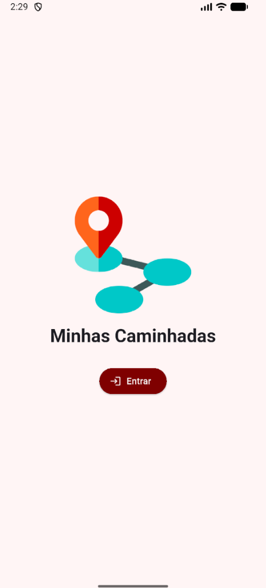
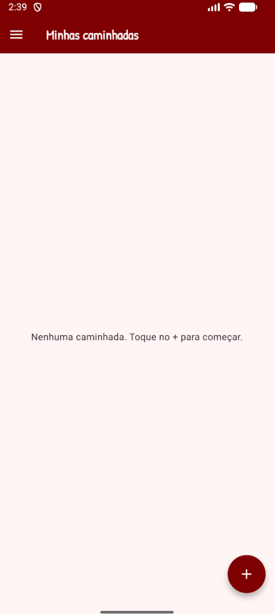
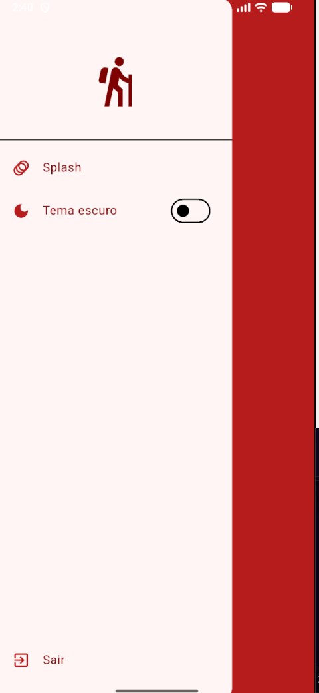
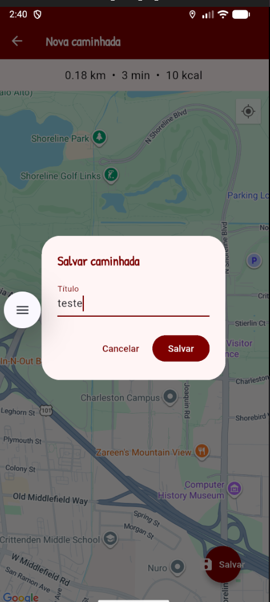
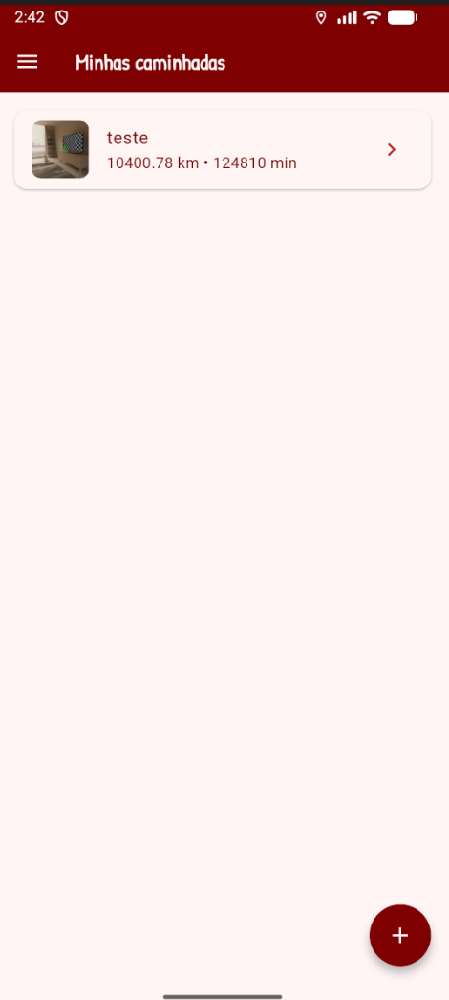

# Flutter Fotos Caminhadas

Aplicativo Flutter para registrar e acompanhar caminhadas. O usuário escolhe um
destino no mapa, visualiza uma estimativa de distância, duração e calorias e
salva o registro localmente. Depois, pode abrir os detalhes e fotografar a
paisagem usando a câmera do celular.

## Funcionalidades

- splash screen com animação de entrada e saída;
- listagem das caminhadas cadastradas;
- menu lateral com splash, tema claro/escuro e sair;
- escolha do destino com Google Maps e localização atual;
- representação do trajeto e estimativas de distância, tempo e calorias;
- armazenamento local dos registros;
- detalhes completos e foto capturada pela câmera;
- foto copiada para o armazenamento interno do aplicativo.

## Tecnologias

- Flutter e Dart;
- Google Maps SDK (`google_maps_flutter`);
- geolocalização (`geolocator`);
- câmera (`image_picker`);
- armazenamento local (`shared_preferences` e `path_provider`).

## Como executar

1. Instale o [Flutter](https://docs.flutter.dev/get-started/install) e o Android
   Studio.
2. Configure uma chave do Google Maps SDK for Android no arquivo
   `flutter_fotos_caminhadas/android/app/src/main/AndroidManifest.xml`.
3. Conecte um celular ou utilize o launcher de um emulador (Android Studio)
4. Na pasta `flutter_fotos_caminhadas`, execute:

```bash
flutter pub get
flutter run
```

O aplicativo solicitará acesso à localização e à câmera no primeiro uso.

## APK

[Baixar o APK](./flutter_fotos_caminhadas/assets/flutter_fotos_caminhadas.apk)

## Screenshots

<p>
  
  
  
  
  
</p>

## Gerar uma nova versão do APK

```bash
flutter build apk --release
```

O arquivo gerado ficará em
`build/app/outputs/flutter-apk/app-release.apk`.
